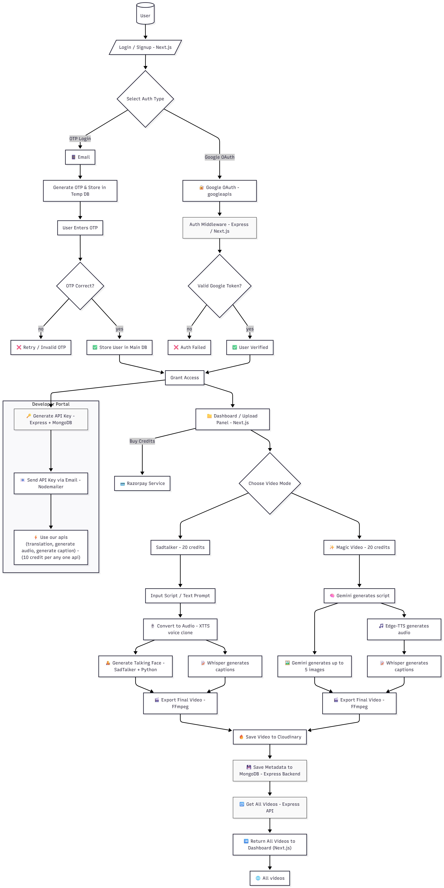

# ZennVid

ZennVid is a full-stack platform for generating, processing, and serving multimedia content — video, audio, and text — using advanced AI/ML capabilities. The platform supports multiple languages, voice styles, and two primary video modes (SadTalker and Magic Video). The README below documents the user and developer flows, the architecture, APIs, and examples.

---

## Project Overview

ZennVid enables users to create short videos from text or prompts using AI models. Users can authenticate, buy credits, pick a video mode, and produce a final video which is stored and surfaced in a dashboard. Developers can generate API keys and use platform APIs under a credit model.

---

## Flowchart — User & Developer Journey



---

## Architecture & Flow (Text Summary)

1. Authentication
   - Users sign up or log in via the Next.js frontend. They can choose OTP login or Google OAuth. OTPs are generated, stored temporarily, and validated; OAuth flows use the Google APIs and are validated by Express/Next.js middleware.
2. Access & Roles
   - Verified users are granted access to the Dashboard and, depending on role, to Admin and Developer portals.
   - Admins can manage users, view transactions, developer usage, and video analytics.
3. Developer Portal
   - Developers can request API keys (stored in MongoDB), receive them by email (Nodemailer), and consume platform APIs (translation, audio generation, caption generation) under a credit model (e.g., 10 credits per API call).
4. Dashboard & Credits
   - The Dashboard (Next.js) is the primary product UI where users purchase credits (Razorpay), upload assets, choose video modes, preview jobs, and view generated videos.
5. Video Modes
   - SadTalker (20 credits): Input script -> XTTS voice clone generates audio -> SadTalker (Python) generates talking-face video -> Whisper generates captions -> FFmpeg exports final video.
   - Magic Video (20 credits): GPT-OSS-20B (script generation) -> Edge-TTS creates audio -> stable-diffusion-xl-base-1.0 (Hugging Face) generates images -> Whisper captions -> FFmpeg export.
6. Export, Storage & Metadata
   - Final videos are saved to Cloudinary. Video metadata (owner, title, URLs, thumbnails, duration, shares, stats) is saved to MongoDB via the Express backend. An API endpoint provides retrieval for the Dashboard and Feed pages.
7. Share & Feed
   - Users can share generated videos to a Feed (Reel-style). The Feed page queries shared videos and renders them for browsing.

---

## API Reference

### Base URL

```
http://localhost:3000/api
```

### Auth / Users

- POST `/api/auth/otp` — request OTP (body: { phoneOrEmail })
- POST `/api/auth/verify-otp` — verify OTP (body: { id, otp })
- POST `/api/auth/oauth/google` — handle Google OAuth callback / token exchange

### Video & Media

- POST `/api/tts` — generate speech audio from text (XTTS/Edge-TTS)
- POST `/api/video` — submit a video generation job (SadTalker or Magic)
- GET `/api/videos` — list videos for a user or feed
- POST `/api/videos/:id/share` — mark video as shared to feed

Refer to the `api-server` folder for route implementations and schemas.

---

## Machine Learning & Media Stack

- XTTS — voice cloning (SadTalker pipeline)
- SadTalker — talking face video generation (Python)
- GPT-OSS-20B — in-house / self-hosted script generation (Magic Video)
- Edge-TTS — audio generation for Magic Video
- stabilityai/stable-diffusion-xl-base-1.0 — image generation (Hugging Face)
- Whisper — caption generation
- FFmpeg — final export and containerization

---

## Backend

- Language: TypeScript (Node.js)
- Framework: Express.js
- Database: MongoDB (metadata, API keys, users, transactions)
- Storage: Cloudinary (videos and thumbnails)
- Payment: Razorpay (credits)

See `api-server/src` for implementation details and routes.

---

## Frontend

- Framework: Next.js (React)
- Pages: Login, Dashboard, Upload, Developer Portal, Feed, Admin
- Components: video preview, share controls, transactions, credit purchase flow

See `web-client/app` and `web-client/components` for the UI code.

---

## Examples

### Request TTS

```typescript
// POST /api/tts
const response = await fetch('/api/tts', {
  method: 'POST',
  headers: { 'Content-Type': 'application/json' },
  body: JSON.stringify({
    text: "Hello, ZennVid!",
    voice: "en-US-AriaNeural",
    style: "realistic"
  })
});
const data = await response.json();
console.log(data.audioUrl);
```

### Submit Video Job

```typescript
// POST /api/video
const response = await fetch('/api/video', {
  method: 'POST',
  headers: { 'Content-Type': 'application/json' },
  body: JSON.stringify({
    mode: 'sadTalker', // or 'magic'
    script: 'Welcome to ZennVid!',
    options: { style: 'anime' }
  })
});
const data = await response.json();
console.log(data.jobId);
```

---

## Constants

### Styles
- Realistic
- Anime
- Cartoon
- Cyberpunk
- Sketch
- Pixel Art

### Credit Model
- SadTalker: 20 credits
- Magic Video: 20 credits
- Developer API calls: 10 credits per API

### Voice Languages & Mappings
Refer to `audio.json` and `api-server/src/constants/Voicemappping.ts` for full mappings.

---

## Where to look in the repo

- `web-client/` — Next.js frontend (pages & components)
- `api-server/` — Express backend, routes, schemas, and utilities
- `ai-service/` — Python helpers, XTTS/SadTalker orchestration, media pipelines
- `SadTalker/` — SadTalker model code and helpers

---

> Note: this README presents a high-level view tied to the current code layout. For implementation details, inspect the route files and services inside `api-server/src` and the frontend components inside `web-client/components` and `web-client/app`.
