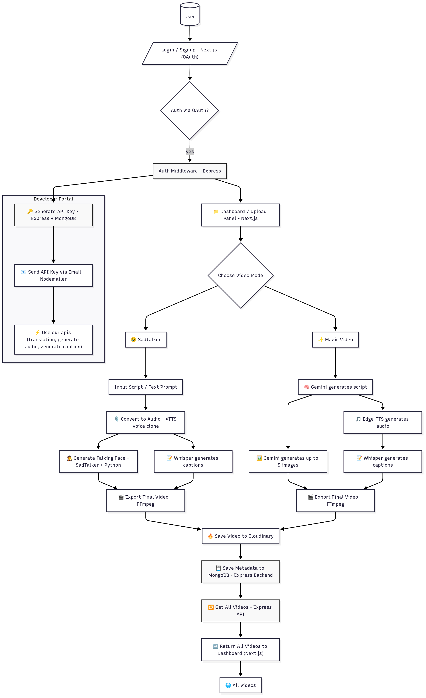

# ZennVid

ZennVid is a full-stack platform for generating, processing, and serving multimedia content, including video, audio, and text, with advanced AI/ML capabilities. It supports a wide range of languages and styles, leveraging modern backend and frontend technologies.

---

## Project Overview

ZennVid enables users to generate and manipulate multimedia content using AI-driven models. It supports multiple languages and voice styles, making it suitable for global applications such as e-learning, entertainment, and accessibility.

---



---

## Features

- **Text-to-Speech (TTS)**: Multi-language, multi-voice support.
- **Video Generation**: Style-based video rendering (realistic, anime, cartoon, etc.).
- **Audio Processing**: Voice gender and language selection.
- **RESTful API**: For integration with other platforms.
- **Frontend Dashboard**: For managing and previewing content.
- **Two Video Modes**: SadTalker (talking face) and Magic Video (AI-generated script and images).

---

## Architecture & Flow

1. **User** interacts via a Next.js frontend (login/signup, dashboard, upload panel).
2. **Authentication** is handled via OAuth and Express middleware.
3. **Choose Video Mode**:
   - **SadTalker**: User provides a script/text prompt.
     - Audio is generated using **XTTS voice clone**.
     - **SadTalker** (Python) generates a talking face video.
     - **Whisper** generates captions.
     - **FFmpeg** exports the final video.
   - **Magic Video**: 
     - **Gemini** generates a script and up to 5 images.
     - **Edge-TTS** generates audio.
     - **Whisper** generates captions.
     - **FFmpeg** exports the final video.
4. **Cloudinary** is used to store videos.
5. **MongoDB** (via Express backend) stores metadata.
6. All videos are accessible via the dashboard.

---

## API Reference

### Base URL

```
http://localhost:3000/api
```

### Endpoints

#### `POST /api/tts`
Generate speech audio from text.

**Request Body:**
```json
{
  "text": "Hello, world!",
  "language": "English (United States)",
  "gender": "Female",
  "style": "realistic"
}
```

**Response:**
```json
{
  "audioUrl": "/audio/tts-12345.wav"
}
```

#### `POST /api/video`
Generate a video with a selected style.

**Request Body:**
```json
{
  "script": "Welcome to ZennVid!",
  "style": "anime"
}
```

**Response:**
```json
{
  "videoUrl": "/video/vid-67890.mp4"
}
```

#### `GET /api/voices`
List all available voices.

**Response:**
```json
[
  {
    "language": "English (United States)",
    "gender": "Female",
    "shortName": "en-US-AriaNeural"
  },
  ...
]
```

---

## Machine Learning Models

- **XTTS (voice clone)**: Used in SadTalker mode to generate personalized audio from text.
- **SadTalker**: Python-based model for generating talking face videos from audio and text.
- **Gemini**: Generates scripts and up to 5 images for Magic Video mode.
- **Edge-TTS**: Generates audio for Magic Video mode.
- **Whisper**: Generates captions for videos.
- **FFmpeg**: Used for final video export and processing.

---

## Backend

- **Language**: TypeScript (Node.js)
- **Framework**: Express.js
- **API Layer**: RESTful endpoints
- **Authentication**: OAuth, Express middleware
- **Database**: MongoDB (for video metadata)
- **Audio/Video Processing**: Integration with Python (SadTalker), XTTS, Whisper, FFmpeg, and cloud AI services.

---

## Frontend

- **Language**: TypeScript/JavaScript
- **Framework**: Next.js (React)
- **UI Library**: Material-UI or Ant Design
- **Features**: Login/Signup, dashboard, upload panel, video preview, and management.

---

## Libraries & Frameworks

### Backend

- **Express.js**: Web server and routing
- **TypeScript**: Type safety
- **Multer**: File uploads
- **dotenv**: Environment variable management
- **Mongoose**: MongoDB integration
- **Cloudinary SDK**: Video storage
- **Python Integration**: For SadTalker and XTTS

### Frontend

- **Next.js**: React-based SSR/SSG framework
- **React.js**: UI framework
- **Redux / Zustand**: State management
- **Material-UI / Ant Design**: UI components
- **Axios / Fetch**: API calls

### Machine Learning

- **XTTS**: Voice cloning for personalized TTS.
- **SadTalker**: Talking face video generation.
- **Gemini**: Script and image generation.
- **Edge-TTS**: Audio generation.
- **Whisper**: Caption generation.
- **FFmpeg**: Video processing.

---

## Examples

### Generate Speech Audio

```typescript
// POST /api/tts
const response = await fetch('/api/tts', {
  method: 'POST',
  headers: { 'Content-Type': 'application/json' },
  body: JSON.stringify({
    text: "Hello, world!",
    language: "English (United States)",
    gender: "Female",
    style: "realistic"
  })
});
const data = await response.json();
console.log(data.audioUrl);
```

### Generate Video

```typescript
// POST /api/video
const response = await fetch('/api/video', {
  method: 'POST',
  headers: { 'Content-Type': 'application/json' },
  body: JSON.stringify({
    script: "Welcome to ZennVid!",
    style: "anime"
  })
});
const data = await response.json();
console.log(data.videoUrl);
```

---

## Constants

### Styles

- Realistic
- Anime
- Cartoon
- Cyberpunk
- Sketch
- Pixel Art

### Voice Languages

See [`src/constants/common.ts`](./src/constants/common.ts) for the full enum list.

### Voice Genders

- Male
- Female

### Voice Full Names

Voice short names are mapped for each language and gender, e.g.:

- `EnglishUnitedStatesFemale = "en-US-AriaNeural"`
- `JapaneseJapanMale = "ja-JP-KeitaNeural"`

See [`src/constants/common.ts`](./src/constants/common.ts) for the full mapping.

---

> **Note:** For a full list of supported voices and languages, see [`audio.json`](./audio.json).
